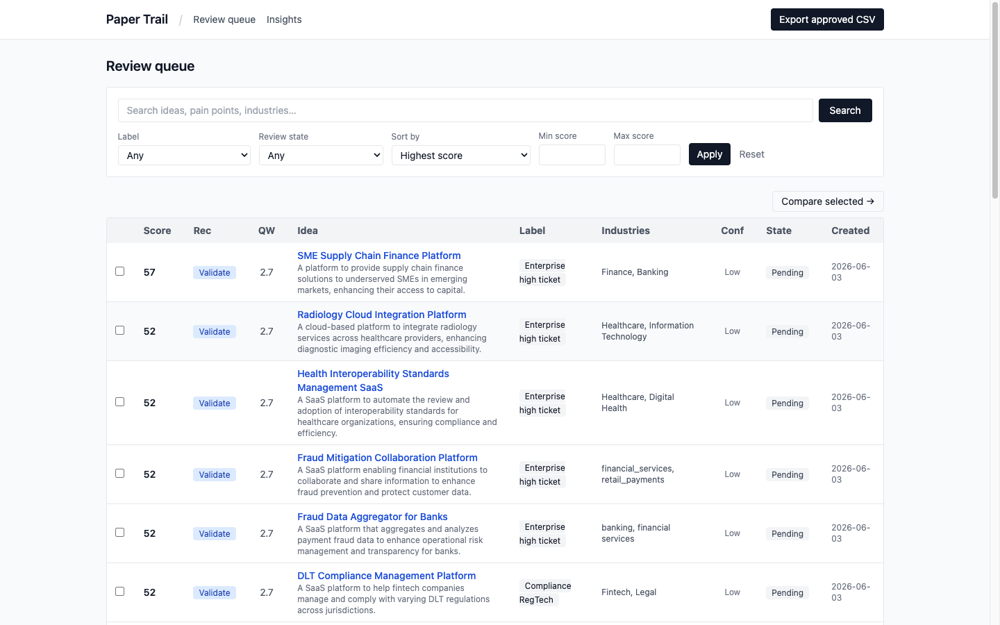
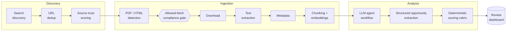
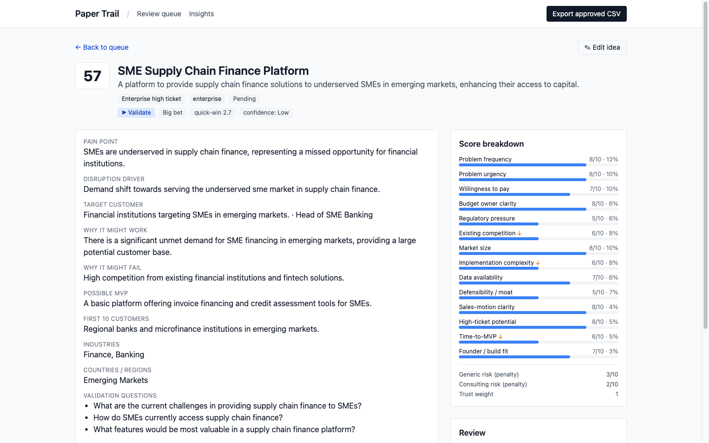

# Paper Trail

[](https://github.com/mateusgetulio/papertrail/actions/workflows/ci.yml)
[](https://goreportcard.com/report/github.com/mateusgetulio/papertrail)
[](./go.mod)
[](./LICENSE)

An **open-source** Go CLI that discovers "market disruption" signals from public business white papers, consulting insights, research reports, and industry publications, then extracts repeated pain points, underserved industries, and ranked SaaS opportunity candidates with citations back to the sources.

> **Status:** Phases 0 to 4 complete. Discovery, ingestion, LLM analysis, deterministic scoring, and the review dashboard (decision matrix, compare view, insights, CSV export) run end to end. See [`docs/09-mvp-backlog.md`](./docs/09-mvp-backlog.md) for what is next.



## How it works

A 13-stage pipeline, each stage idempotent and resumable. The compliance gate is the safety choke point: nothing is downloaded without passing it. Full detail in [`docs/04-architecture.md`](./docs/04-architecture.md).



Design choices worth noting:

- **LLM judges, code decides.** The model produces sub-scores with evidence; a deterministic Go rubric ([`docs/06-scoring-rubric.md`](./docs/06-scoring-rubric.md)) turns them into a reproducible, explainable 1 to 100 ranking. No score exists without a stored component breakdown.
- **Provider-agnostic LLM layer.** One cheap OpenAI model behind an `LLMClient` interface, structured-output mode, so the model tier can change without touching the pipeline.
- **Compliance is a pipeline stage, not a policy document.** robots.txt, gating detection, and rate limits are enforced in code before any fetch.

## Validate before you build

The pipeline ends in a decision, not a product. Every candidate is labelled **Build now / Validate / Park**, and "Validate" has a concrete meaning: a ladder of demand tests you can run **without writing an MVP**, from community mining and problem interviews up to smoke tests and paid commitments, each with a numeric pass bar. That playbook is [`docs/00-audience-validation.md`](./docs/00-audience-validation.md), and it gates the feasibility phase: no engineering time until pain, reach, and money are evidenced.



## What it produces

Each run emits a Markdown + JSON report (per-run, local only, never committed). An excerpt:

```markdown
## Decision Matrix (top 25)

| # | Idea                                | Score | Rec      | QW  | Quadrant | Conf |
|---|-------------------------------------|------:|----------|----:|----------|------|
| 1 | SME Supply Chain Finance Platform   |    57 | Validate | 2.7 | Big bet  | Low  |
| 2 | Radiology Cloud Integration Platform|    52 | Validate | 2.7 | Big bet  | Low  |

#### 1. SME Supply Chain Finance Platform · score 57/100 · Validate
- Disruption: demand shift toward the underserved SME market in supply chain finance.
- Buyer persona: Head of SME Banking · high-ticket 8/10
- MVP: invoice financing + credit assessment tools for SMEs.
- Evidence: citations back to the source documents (never full text).
```

The JSON contract is specified in [`docs/08-output-format.md`](./docs/08-output-format.md).

## What this is (and is not)

- **Is:** open-source **code** that you run yourself, with your own API keys, to produce *original analysis*: structured summaries, scores, and citations pointing back to source material.
- **Is not:** a content aggregator, a republisher of report text, or a hosted service that serves proprietary report content. The repository ships **code only**, never source PDFs, extracted text, or report content.

## Open code, private content

The **code** is open source under the [MIT License](./LICENSE). The **content** it processes is not redistributed, and that separation is what keeps the legal-risk posture intact:

- **The repo never contains copyrighted material.** Source PDFs, extracted text, chunk fixtures, embeddings, and database dumps stay out of version control (`*.pdf` and `.env` are gitignored). Removing report text from the repo removes the main copyright-infringement vector.
- **Operators run their own instance** with their own keys and their own data store. What an operator does with short excerpts for private analysis sits far closer to fair-use/fair-dealing territory than public redistribution.
- **Don't host it as a public service that serves proprietary report content.** Doing so reintroduces end-user ToS, DMCA exposure, and scaled-redistribution claims that the project is designed to avoid.
- Paper Trail stores and acts on **metadata + citations + short, legally-safe excerpts + original LLM-generated summaries**, never full proprietary documents when not necessary.

## Compliance stance (summary)

Hard rules, detailed in [`docs/03-compliance.md`](./docs/03-compliance.md):

- Do **not** bypass paywalls, login gates, email-gated downloads, anti-bot systems, or `robots.txt`.
- Do **not** violate any source's Terms of Service.
- Do **not** mass-crawl, and do **not** copy large amounts of copyrighted content.
- **Do** use public metadata, allowed downloads, citations, short excerpts where legally safe, and original summaries.

## Tech stack

- **Language:** Go (orchestration, concurrency, HTTP clients, server-rendered dashboard).
- **PDF text:** shell out to Poppler `pdftotext` (Go's native PDF libraries are thin).
- **LLM analysis/scoring:** a single cheap OpenAI model, structured-output mode, behind a provider-agnostic `LLMClient` interface.
- **Storage:** Postgres + `pgvector` (via `pgx`) for embeddings, dedup, and clustering.
- **Dashboard:** `html/template` + HTMX + a compiled Tailwind stylesheet, all embedded in the binary via `go:embed`. The binary is fully self-contained: no CDN, no runtime asset step.
- **Search discovery:** starts free/cheap (Brave free tier), with an upgrade path to Exa/Tavily/SerpAPI.

## Quick start

Requirements: Go 1.26+, Docker (Postgres + pgvector), Poppler (`pdftotext`).

```bash
cp .env.example .env        # add your own OPENAI_API_KEY + BRAVE_API_KEY
docker compose up -d db     # Postgres + pgvector on :807
make migrate                # apply schema migrations
go build ./...

go run ./cmd/papertrail discover --limit 5   # find candidate sources
go run ./cmd/papertrail ingest   --limit 3   # fetch, extract, embed
go run ./cmd/papertrail analyse  --limit 10  # LLM workflow, scored ideas
go run ./cmd/papertrail serve                # review dashboard on :8080
```

You bring your own API keys; none are shipped with the project.

## Development

```bash
make test    # go test ./... -race
make lint    # golangci-lint run
make css     # recompile the embedded Tailwind stylesheet (needs npx)
```

CI runs build, vet, race-enabled tests, and golangci-lint on every push and pull request.

## Document index

| # | Doc | Covers |
|---|-----|--------|
| 00 | [`docs/00-audience-validation.md`](./docs/00-audience-validation.md) | Pre-MVP demand validation ladder + go/no-go gate |
| 01 | [`docs/01-feasibility-report.md`](./docs/01-feasibility-report.md) | Technical + legal feasibility verdict |
| 02 | [`docs/02-source-discovery.md`](./docs/02-source-discovery.md) | Sources, search API comparison, query patterns |
| 03 | [`docs/03-compliance.md`](./docs/03-compliance.md) | robots.txt, ToS, copyright, retention policy |
| 04 | [`docs/04-architecture.md`](./docs/04-architecture.md) | Go pipeline, 13 stages, infra |
| 05 | [`docs/05-data-model.md`](./docs/05-data-model.md) | Postgres schema + DDL |
| 06 | [`docs/06-scoring-rubric.md`](./docs/06-scoring-rubric.md) | Opportunity scoring model |
| 07 | [`docs/07-agent-workflow.md`](./docs/07-agent-workflow.md) | LLM agent loop + labels |
| 08 | [`docs/08-output-format.md`](./docs/08-output-format.md) | Candidate JSON contract + examples |
| 09 | [`docs/09-mvp-backlog.md`](./docs/09-mvp-backlog.md) | Phased build backlog |
| 10 | [`docs/10-risk-register.md`](./docs/10-risk-register.md) | Risk register + prohibited actions |

## Contributing

Contributions are welcome; see [`CONTRIBUTING.md`](./CONTRIBUTING.md) and the
[Code of Conduct](./CODE_OF_CONDUCT.md). The one hard rule: never commit
secrets or ingested source content, and never add code that bypasses access
controls or `robots.txt`. Security issues: see [`SECURITY.md`](./SECURITY.md).

## License

[MIT](./LICENSE) © 2026 Mateus Vieira. You run your own instance with your own
keys and data; the license covers the code, not any third-party content you
choose to process with it.

## Disclaimer

These documents are engineering design guidance, **not legal advice**. Confirm each source's current `robots.txt` and Terms of Service at build time, and have counsel review the compliance posture before production use.
